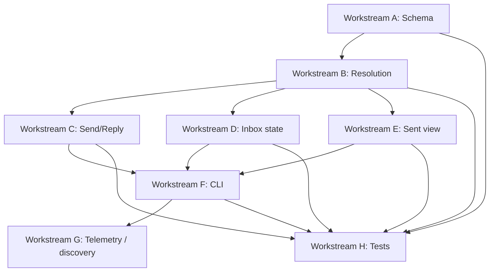

# Inbox — Parallel Workstreams

This doc explains how to split Inbox into parallel planning or implementation tracks without losing the locked protocol behavior.

## Recommended workstreams

### Workstream A — Schema and persistence
Scope:
- migrations / schema bootstrap
- DDL application
- trigger installation
- seed data helpers

Output:
- stable SQLite foundation

### Workstream B — Resolution engine
Scope:
- actor resolution
- inbox resolver
- sent resolver
- thread visibility union
- list expansion
- active-recipient filtering

Output:
- reusable resolution helpers

### Workstream C — Send / reply write path
Scope:
- send transaction
- reply transaction
- delivery creation
- delivery_sources population
- sent_items creation
- resolution summary output
- calls shared resolution helpers from Workstream B for actor validation, list expansion, and recipient validation

Output:
- atomic message creation path

### Workstream D — Inbox state mutation
Scope:
- read / peek
- ack
- hide / unhide
- delivery event append logic
- idempotent mutation behavior

Output:
- delivery mutation layer

### Workstream E — Sent view state
Scope:
- sent list/read
- sent hide/unhide

Output:
- sender-view query/mutation layer

### Workstream F — CLI harness
Scope:
- command parsing
- env handling
- text rendering
- JSON rendering
- exit code mapping

Output:
- agent-facing CLI

### Workstream G — Telemetry and discovery mode
Scope:
- OTEL hooks
- research-mode sparse help
- attempted-command capture
- `inbox give-feedback` implementation
- local NDJSON capture plumbing
- experimental profile/tier exposure

Output:
- operational learning layer

### Workstream H — Tests and fixtures
Scope:
- seed scenarios
- invariant regression tests
- golden outputs
- JSON discipline checks

Output:
- proof that implementation matches spec

## Suggested dependency order
1. A first
2. B next
3. C, D, E in parallel once B is stable
4. F once command request/response shapes are frozen
5. G once commands exist to instrument
6. H starts early and grows alongside all other work

## Freeze-before-parallel checklist
Before multiple agents start implementing in parallel, freeze these:
- schema names
- command names and flags
- error-code vocabulary
- send result JSON shape
- thread item JSON shape
- mutation result JSON shape
- give-feedback result JSON shape
- resolution discipline
- visibility rules
- experimental profile names and capture-mode names

## Biggest anti-drift warnings
Do not let parallel agents independently invent:
- thread visibility logic
- reply-all audience logic
- hidden-message read/thread behavior
- delivery event emission rules
- text/JSON output formats

## Dependency sketch

